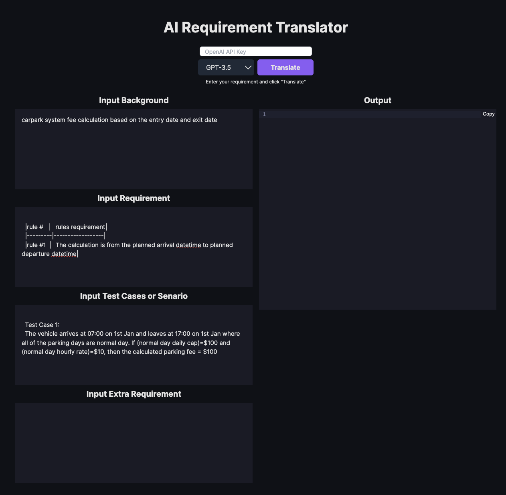

# AI Requirement Translator

Use AI to translate code from one language to another.



## Running Locally

**1. Clone Repo**

```bash
git clone https://github.com/kkwilllo/ai-requirement-translator.git
```

**2. Install Dependencies**

```bash
npm i
```

**3. Run App**

```bash
npm run dev
```

